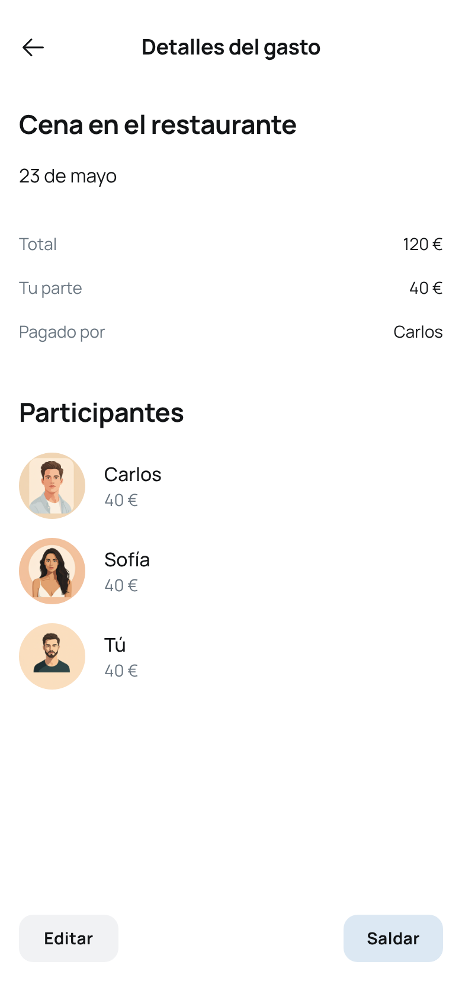
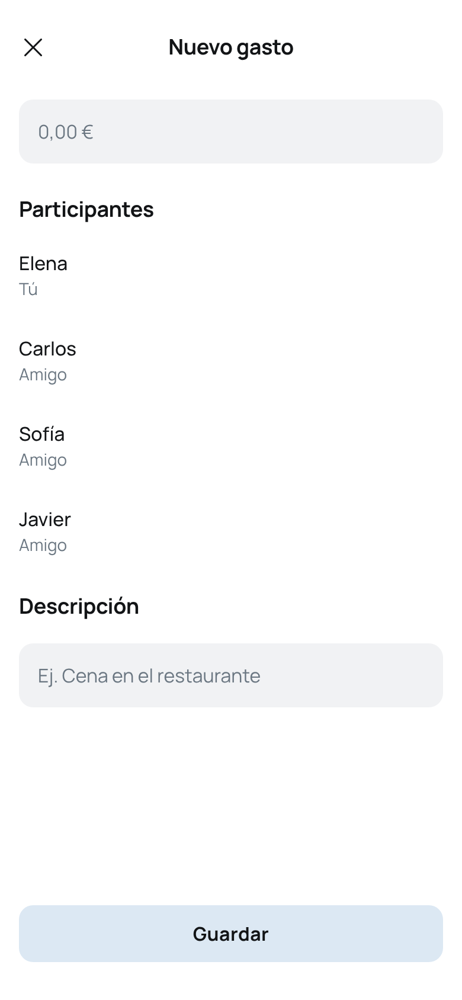

# Gestor de Gastos Compartidos (tipo Splitwise)

## ¿Qué es esta aplicación?

Esta aplicación permite registrar y repartir gastos entre varias personas. La idea es que un grupo de amigos, compañeros de piso, de viaje o de evento, pueda apuntar quién paga qué y entre quiénes se reparte.
Aquí el ejemplo en el que está basado [Splitwise](https://www.splitwise.com)

Por ejemplo:
> Ana paga una cena de 60€ entre ella, Juan y Luis.  
> La app registra ese gasto y automáticamente calcula que Juan y Luis le deben 20€ cada uno a Ana.

La app debe mostrar los gastos, quién ha pagado, entre cuántas personas se reparte, y calcular las **deudas pendientes** entre ellos.

---

## Tecnologías obligatorias

- **Frontend**: React + React Router
- **Backend**: Node.js + Express
- **Base de datos**: MongoDB + Mongoose

---

## Organización del proyecto

### Backend

El backend se encargará de:

- Gestionar los datos de **usuarios** y **gastos**
- Calcular las deudas según los gastos registrados
- Exponer una **API REST** con rutas para cada operación CRUD

Rutas necesarias:
| Método | Ruta            | Descripción                        |
|--------|------------------|------------------------------------|
| GET    | /expenses        | Listar todos los gastos            |
| GET    | /expenses/:id    | Ver un gasto por su ID             |
| POST   | /expenses        | Crear un nuevo gasto               |
| PUT    | /expenses/:id    | Editar un gasto                    |
| DELETE | /expenses/:id    | Borrar un gasto                    |
| GET    | /users           | Listar usuarios                    |
| POST   | /users           | Crear un usuario nuevo             |

---

### 📦 Base de datos (MongoDB)

Se usarán **dos colecciones**: `users` y `expenses`.

#### Modelo: `User`

Este modelo representa a las personas que forman parte del grupo de gastos.

```js
{
  _id: ObjectId,
  name: String,
  email: String
}
```
## ¿Por qué es importante el modelo de usuario?

Los usuarios son la base para poder registrar los gastos.  
Cada gasto tiene un `paidBy` (quién lo pagó) y una lista de `participants` (los que lo comparten).  
Por tanto, **debe haber usuarios creados antes de registrar ningún gasto**.

---

### Ejemplo práctico inicial

Crea 3 usuarios desde el frontend o con peticiones manuales:

```json
{ "name": "Ana", "email": "ana@email.com" }
{ "name": "Juan", "email": "juan@email.com" }
{ "name": "Luis", "email": "luis@email.com" }
```
Con esos tres usuarios se podrán añadir gastos en los que participen.

#### Modelo: `Expense`

Este modelo representa cada gasto que se ha hecho.

```js
{
  _id: ObjectId,
  title: String,
  amount: Number,
  paidBy: ObjectId,         // Usuario que pagó
  participants: [ObjectId], // Usuarios entre los que se reparte
  date: Date,
  description: String
}
```
#### Ejemplo de gasto

```js
{
  "title": "Cena en restaurante",
  "amount": 60,
  "paidBy": "ana_id",
  "participants": ["ana_id", "juan_id", "luis_id"],
  "description": "Cena del viernes por la noche",
  "date": "2025-07-22T00:00:00.000Z"
}
```
Este gasto significa que Ana ha pagado 60€ que se reparten entre los tres → cada uno paga 20€,
pero como Ana ya ha pagado 60€, Juan y Luis le deben 20€ cada uno.

### Frontend (React)
El frontend debe mostrar y permitir navegar entre las diferentes secciones de la aplicación.
Usaremos React Router para manejar las vistas.

### Páginas
| Ruta                 | Descripción                                               |
| -------------------- | --------------------------------------------------------- |
| `/`                  | Página principal con resumen de deudas (obligatoria)      |
| `/expenses`          | Listado completo de gastos registrados (opcional)         |
| `/expenses/:id`      | Detalle de un gasto (obligatoria)                         |
| `/expenses/new`      | Formulario para crear un nuevo gasto (obligatoria)        |
| `/expenses/:id/edit` | Editar un gasto existente (obligatoria)                   |
| `/users`             | Lista de usuarios (opcional, útil para ver participantes) |

## Aquí están los ejemplos para inspirarte
### Inicio


### Detalles gasto


### Editar gasto


### Nuevo gasto


### Lógica del reparto (cálculo de deudas)
Cuando se registra un gasto:
- Se toma el importe total
- Se divide entre el número de participantes
- Se calcula cuánto le deben al que pagó

#### Ejemplo real

```js
- // Gasto:
title: "Supermercado"
amount: 90
paidBy: Ana
participants: Ana, Juan, Luis

// Cálculo:
90€ ÷ 3 = 30€ cada uno

// Resultado:
- Juan debe 30€ a Ana
- Luis debe 30€ a Ana
```

La lógica de estos cálculos se puede hacer:
- En el backend (por ejemplo, para las rutas de resumen o cálculos agregados)
- O en el frontend (al mostrar el reparto en tiempo real)

⚠️ No hace falta crear una colección de "deudas":
Las deudas pueden calcularse dinámicamente a partir de los gastos registrados.

### Requisitos mínimos
- CRUD completo de usuarios y gastos
- Lógica de reparto entre participantes
- Mostrar quién debe cuánto a quién
- Navegación funcional entre páginas
- Buen uso de fetch, estado y React Router

### Recomendación de desarrollo
- Crear primero el backend con endpoints funcionales y testear con Postman.
- Crear componentes de React para cada vista.
- Conectar el frontend con el backend (fetch o axios).
- Añadir estilos y validaciones básicas.
- Probar con varios usuarios y gastos reales para validar los cálculos.

-----

# Instrucciones paso a paso para el proyecto "Gestor de Gastos Compartidos"

-----

## Estructura del proyecto

**IMPORTANTE:** El proyecto debe estar **dividido en dos repositorios independientes**:
* Un repositorio para el **frontend (React)**
* Un repositorio para el **backend (Node.js + Express)**

❌ Si el frontend y el backend están en el mismo repositorio, el proyecto **NO se corregirá**.

-----

## Inicialización del proyecto
### Backend (Node.js + Express + MongoDB) La base de datos estará en [Atlas](https://www.mongodb.com/products/platform/atlas-database) 

1. Crea una carpeta nueva y ejecuta:

    ```bash
    npm init -y
    ```

2. Instala las dependencias necesarias:

    ```bash
    npm install express mongoose cors dotenv
    ```

3.  Crea un archivo `server.js` o `index.js` como punto de entrada.

4.  Configura las rutas y controladores para los modelos `User` y `Expense`.

5.  Usa `dotenv` para almacenar la conexión a MongoDB y el puerto:

    ```env
    PORT=3000
    MONGO_URI=mongodb+srv://...
    ```

6.  Asegúrate de usar CORS correctamente para aceptar peticiones desde el frontend:

    ```javascript
    const cors = require('cors');
    app.use(cors());
    ```

7.  Sube el backend a un repositorio en GitHub llamado `splitwise-back` (o similar).

### Frontend (React + Vite)

1.  Crea tu frontend con:

    ```bash
    npm create vite@latest
    ```

2.  Selecciona React como framework y JavaScript o TypeScript según tu preferencia.

3.  Instala React Router:

    ```bash
    npm install react-router-dom
    ```

4.  Organiza las rutas en tu proyecto (gastos, usuarios, etc.).

5.  Usa `fetch` o `axios` para conectarte con el backend.

6.  Crea un archivo `.env` en el frontend:

    ```env
    VITE_BACKEND_URL=https://tu-api-en-render.com
    ```

7.  Sube el frontend a un repositorio en GitHub llamado `splitwise-front` (o similar).

-----

## Despliegue

### Backend en Render

1.  Crea un nuevo servicio web y conecta el repositorio del backend.

2.  Añade tus variables de entorno en el panel de configuración (`PORT`, `MONGO_URI`, etc.).

3.  Asegúrate de que Render use el comando de arranque correcto:

    ```bash
    node server.js
    ```

4.  Copia la URL del backend en producción (ejemplo: `https://splitwise-api.onrender.com`)

### Frontend en Netlify

1.  Sube tu frontend a GitHub y enlázalo con Netlify.
2.  Asegúrate de configurar la variable `VITE_BACKEND_URL` en Netlify.
3.  Netlify detectará Vite automáticamente y hará el build.
4.  Copia la URL del frontend en producción (ejemplo: `https://splitwise.netlify.app`)

-----

## Entrega obligatoria

Al final del proyecto deberás entregar:
- ✅ Enlace al repositorio del backend
- ✅ Enlace al repositorio del frontend
- ✅ URL de producción del backend (Render)
- ✅ URL de producción del frontend (Netlify)
- ✅ Contenido de los archivos `.env` que hayas utilizado en ambos lados

**Ejemplo:**

```text
Backend Repo: https://github.com/usuario/splitwise-back
Frontend Repo: https://github.com/usuario/splitwise-front
Backend Producción: https://splitwise-api.onrender.com
Frontend Producción: https://splitwise.netlify.app

.env BACKEND:
PORT=3000
MONGO_URI=mongodb+srv://...

.env FRONTEND:
VITE_BACKEND_URL=https://splitwise-api.onrender.com
```

-----

## Recomendaciones

  * 🧪 **Prueba siempre antes de subir:** crea usuarios, añade gastos, revisa los cálculos.
  * 🧼 **Cuida la estructura de carpetas, el estilo visual y los mensajes de error.**
  * 📋 **No olvides un `README.md` claro en cada repo** (instrucciones, dependencias, uso).
